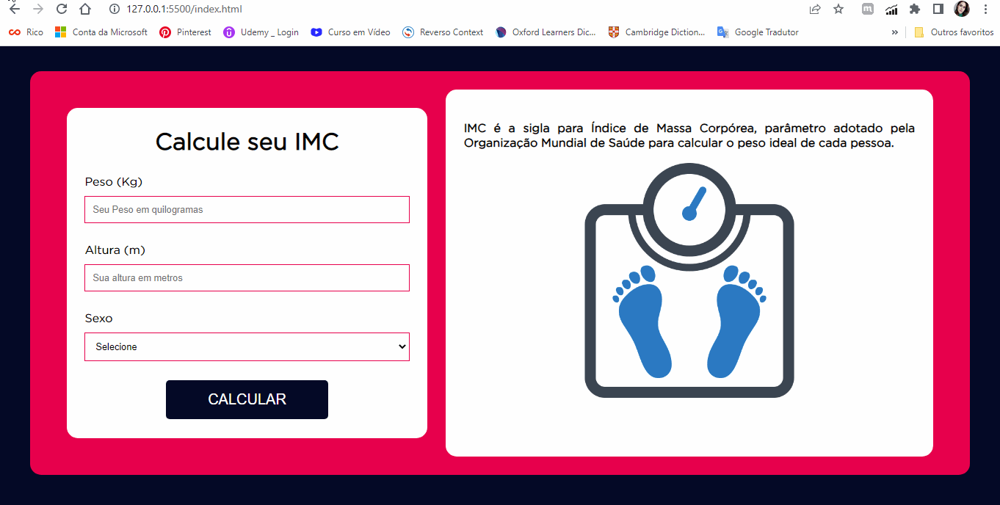
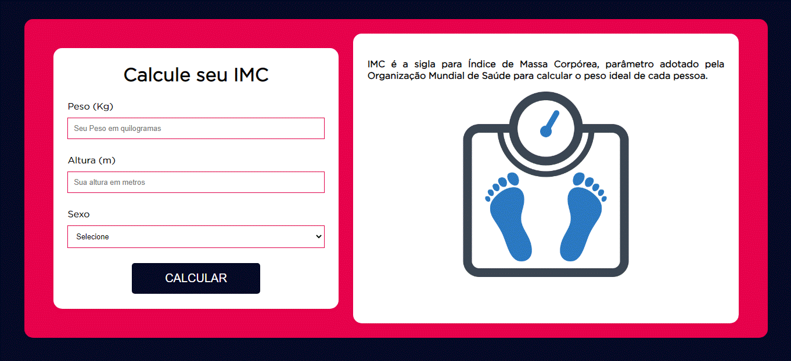
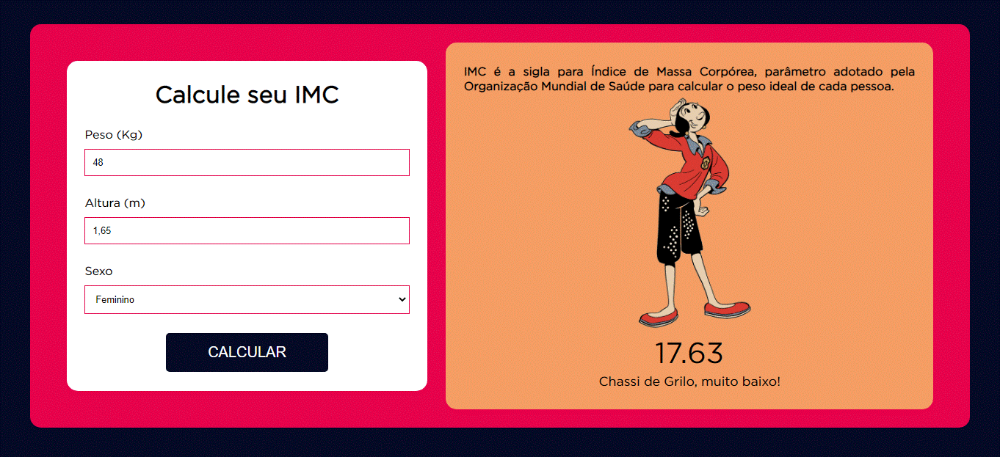
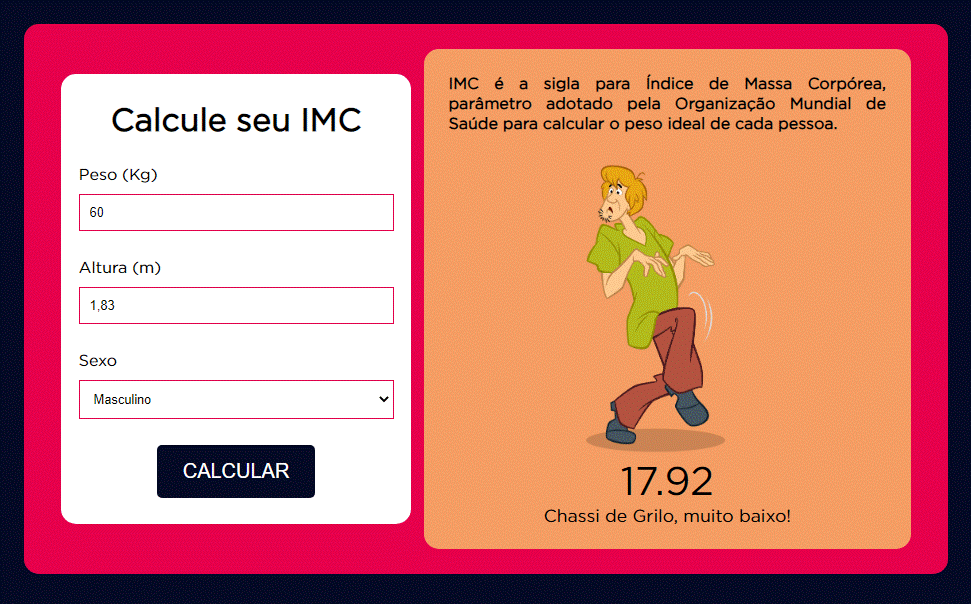
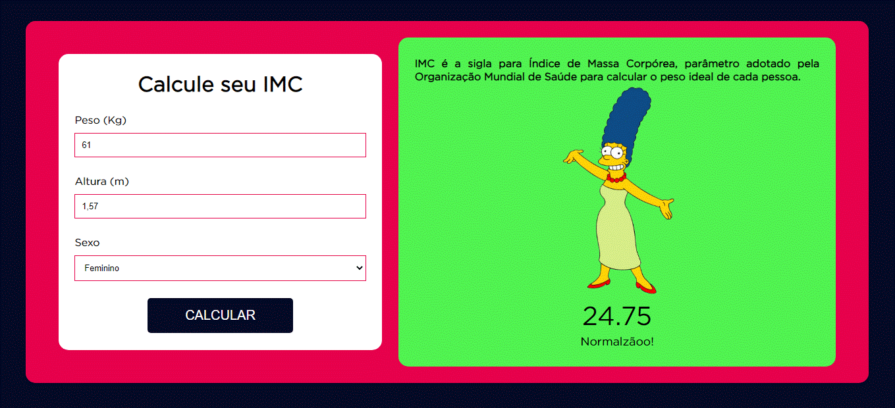
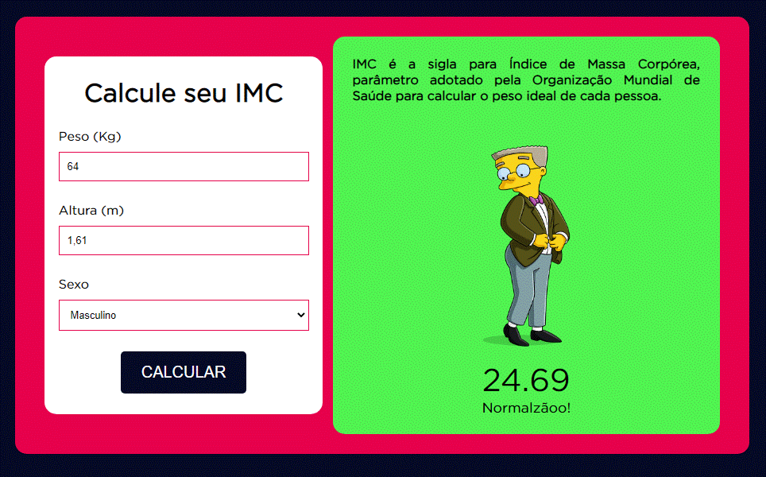
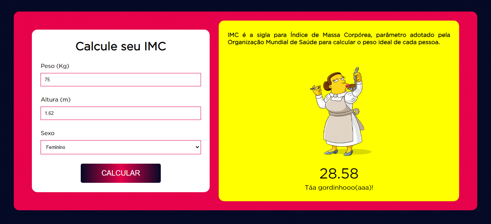
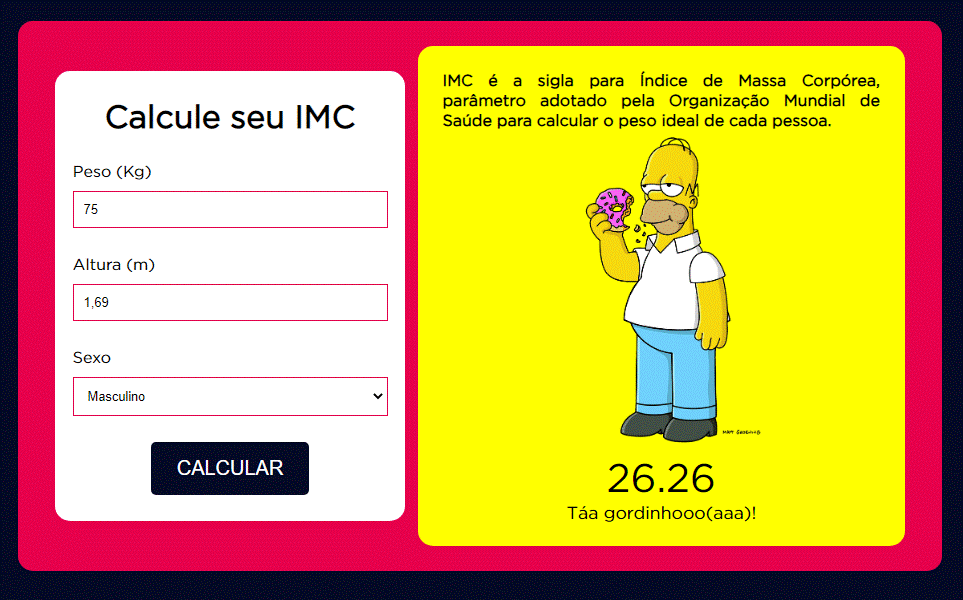
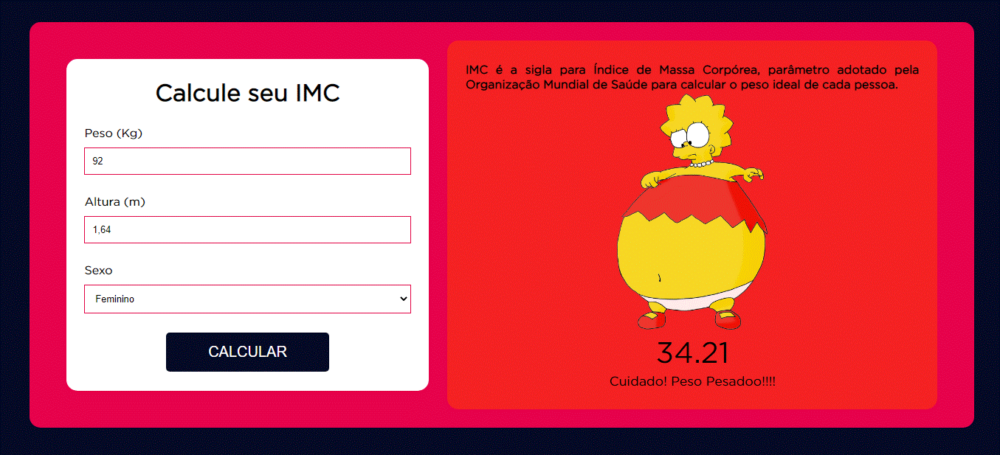
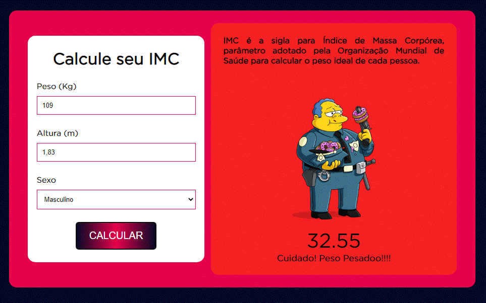

# Calculadora de IMC - Índice de Massa Corporal

## Descrição
Em uma aula de Laboratório de Hardware e Sistemas o professor exemplificou um determinado tema com um programinha em JavaScript que realizava o cálculo de IMC.  Com base na ideia inicial eu quis desenvolver este programinha de forma divertida e simplificada.
 

## Objetivo

Desenvolver uma calculadora de IMC com a linguagem JavaScript e apresentar os resultados de forma inusitada. 

Utilizar o o DOM (Document Object Model) para manipular os dados informados pelo usuário. 

Acrescentar animação aos resultados para apresenta-los de uma forma divertida.

O desenvolvimento deste projeto visa estudar e praticar a linguagem JavaScript.

 

## Tecnologias
 - HTML5
 - CSS3
 - JavaScript
 

## Detalhes

:iphone:

  

 

   

:computer:

Tela Inicial da Calculador de IMC

 
 

Exemplo Calculado de IMC inferior a 18,5 - Abaixo do Normal:

 
 
 

Exemplo Calculado de IMC entre 18,5 e 24,9 - Normal:

 
 

Exemplo Calculado de IMC entre 25,0 e 29,9 - Acima do Peso:

 
 

Exemplo Calculado de IMC acima de 30,0 - Obesidade:

 
 
 

## Autoria
### Autora
Ioly M. M. Oliveira
